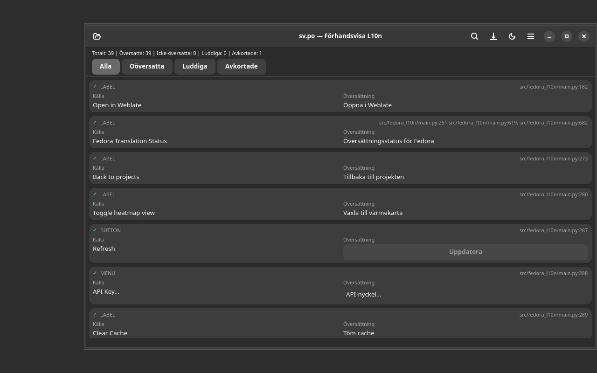
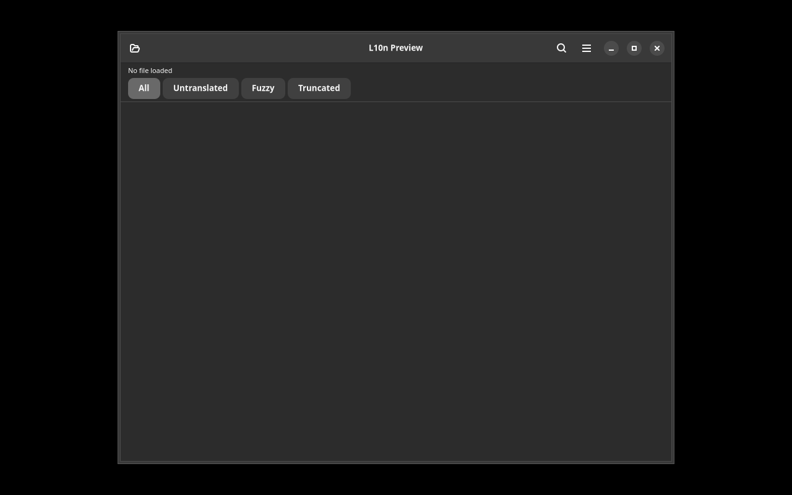

# L10n Preview

## Screenshot



A GTK4/Adwaita application for previewing translation files with simulated UI elements and quality indicators.



## Features

- Open .po and .ts files
- Render strings as simulated UI elements (buttons, menus, dialogs, labels)
- Highlight truncated strings
- Source vs translation side by side
- Highlight untranslated and fuzzy strings
- Filter: all/untranslated/fuzzy/truncated
- Search strings
- Statistics: translated/untranslated/fuzzy count

## Installation

### Debian/Ubuntu

```bash
# Add repository
curl -fsSL https://yeager.github.io/debian-repo/KEY.gpg | sudo gpg --dearmor -o /usr/share/keyrings/yeager-archive-keyring.gpg
echo "deb [signed-by=/usr/share/keyrings/yeager-archive-keyring.gpg] https://yeager.github.io/debian-repo stable main" | sudo tee /etc/apt/sources.list.d/yeager.list
sudo apt update
sudo apt install l10n-preview
```

### Fedora/RHEL

```bash
sudo dnf config-manager --add-repo https://yeager.github.io/rpm-repo/yeager.repo
sudo dnf install l10n-preview
```

### From source

```bash
pip install .
l10n-preview
```

## 🌍 Contributing Translations

This app is translated via Transifex. Help translate it into your language!

**[→ Translate on Transifex](https://app.transifex.com/danielnylander/l10n-preview/)**

Currently supported: Swedish (sv). More languages welcome!

### For Translators
1. Create a free account at [Transifex](https://www.transifex.com)
2. Join the [danielnylander](https://app.transifex.com/danielnylander/) organization
3. Start translating!

Translations are automatically synced via GitHub Actions.
## License

GPL-3.0-or-later — Daniel Nylander <daniel@danielnylander.se>
